# SwitchGamesShowcase
## Overview
SwitchGamesShowcase is a platform dedicated to reviewing and exploring Nintendo Switch games. It provides users with the ability to browse and review games, enhancing their gaming experience by offering insights, liking, and community interactions.  
Check out the live version of the website [here](https://drf-api-sgr-978626b69766.herokuapp.com/).

## Purpose
SwitchGamesShowcase aims to provide Nintendo Switch enthusiasts with a seamless platform to explore and review their favorite games. By leveraging APIs and integrating robust frontend technologies, the goal is to deliver a user-friendly experience that allows for easy navigation, game discovery.
___
## UI/UX
The design of SwitchGamesShowcase focuses on simplicity and intuitive user experience, ensuring gamers can easily browse and review games. The UI draws inspiration from the walkthrough project to provide a social media-like platform treatment that feels familiar.

### Agile Methodology 
Agile method was followed during the development of the site to ensure the best outcome through iterative progress. This approach enabled us to adapt to changes, prioritize features effectively, and ensure the end product meets user expectations.
I utilized a Kanban board to track progress, manage features, and address user stories effectively. You can view the Kanban board and follow the development journey [here](https://github.com/users/sakixchy/projects/10/).

### Wireframes

I used [Balsamiq](https://balsamiq.com/) to create the wireframes for desktop and mobile version of the website. They are purely conceptual layouts and doesn't represent final wesbite.

Below you'll find all the images of wireframes:  

    

        Desktop Wireframes
    

    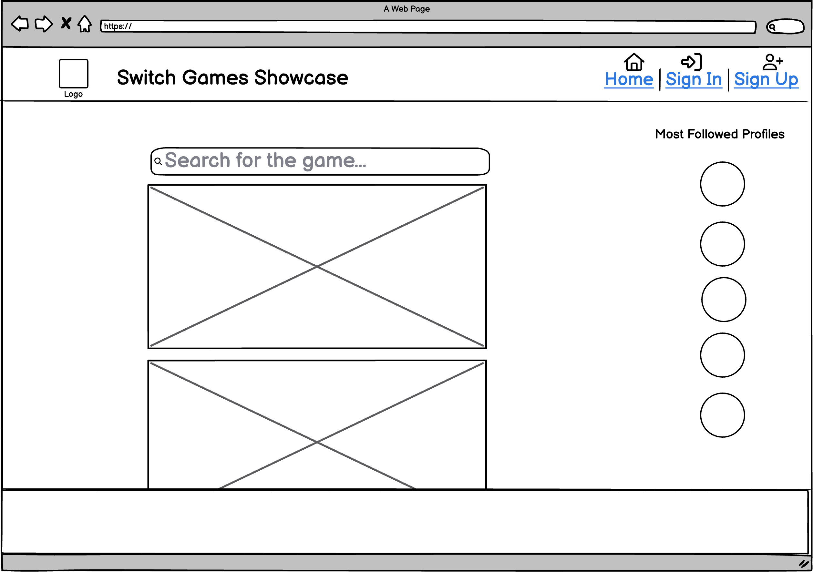
    
    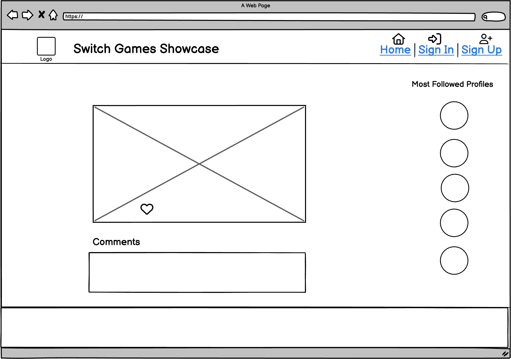
    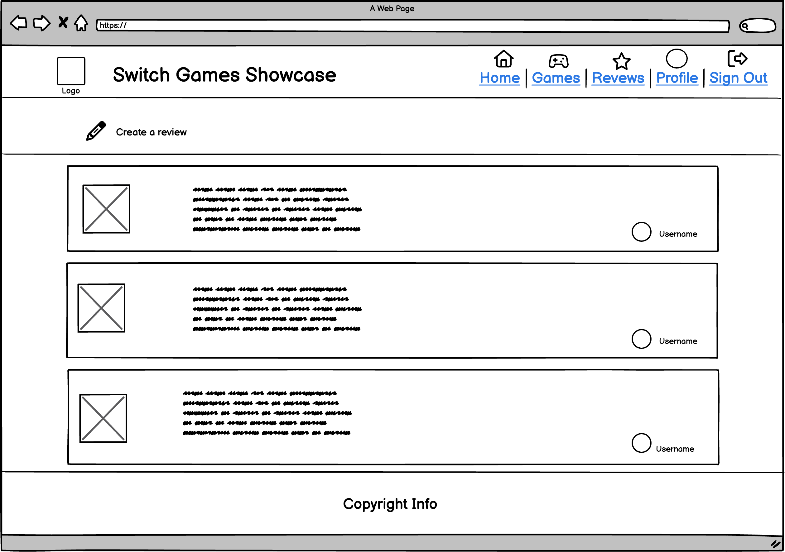
    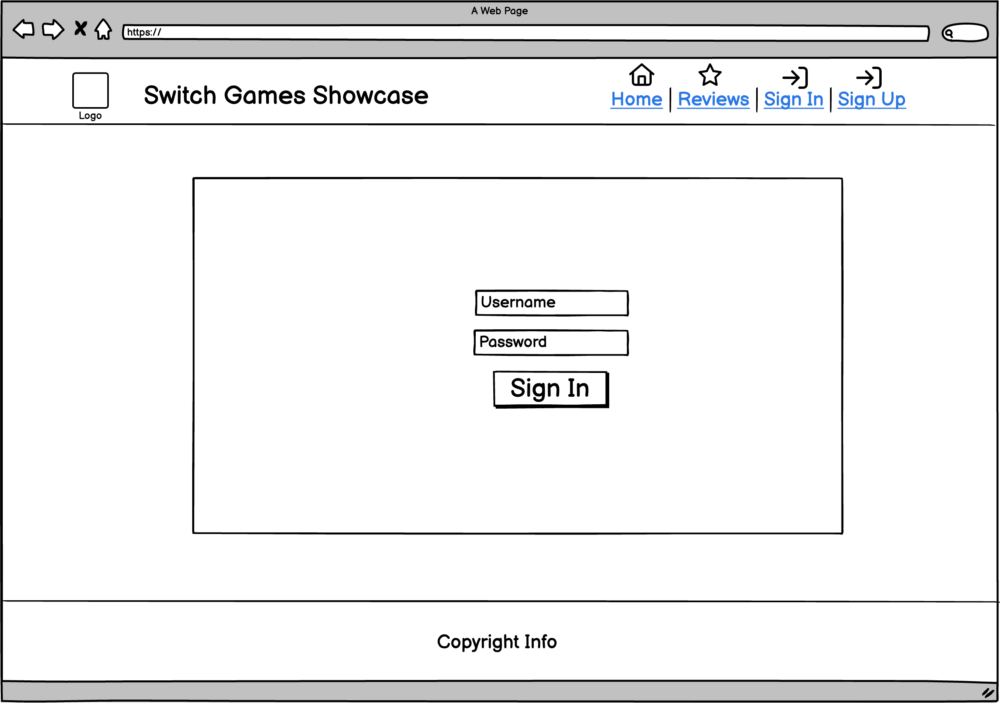
    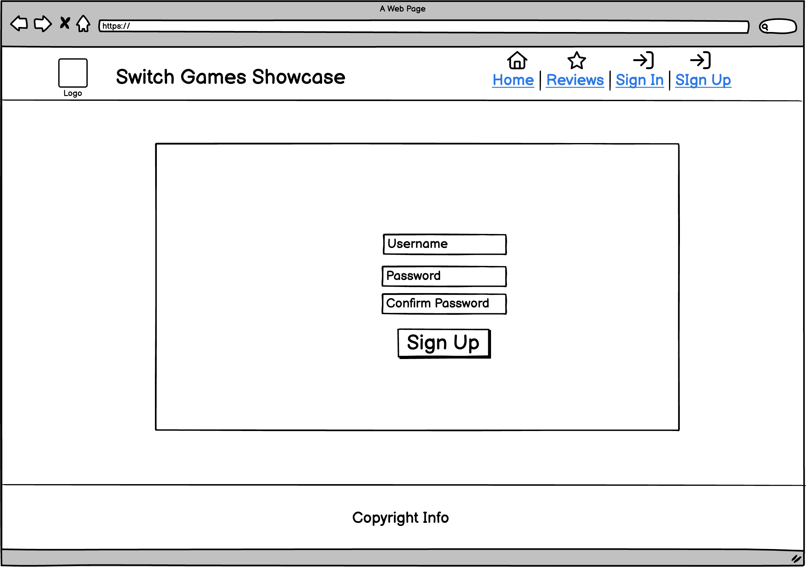
    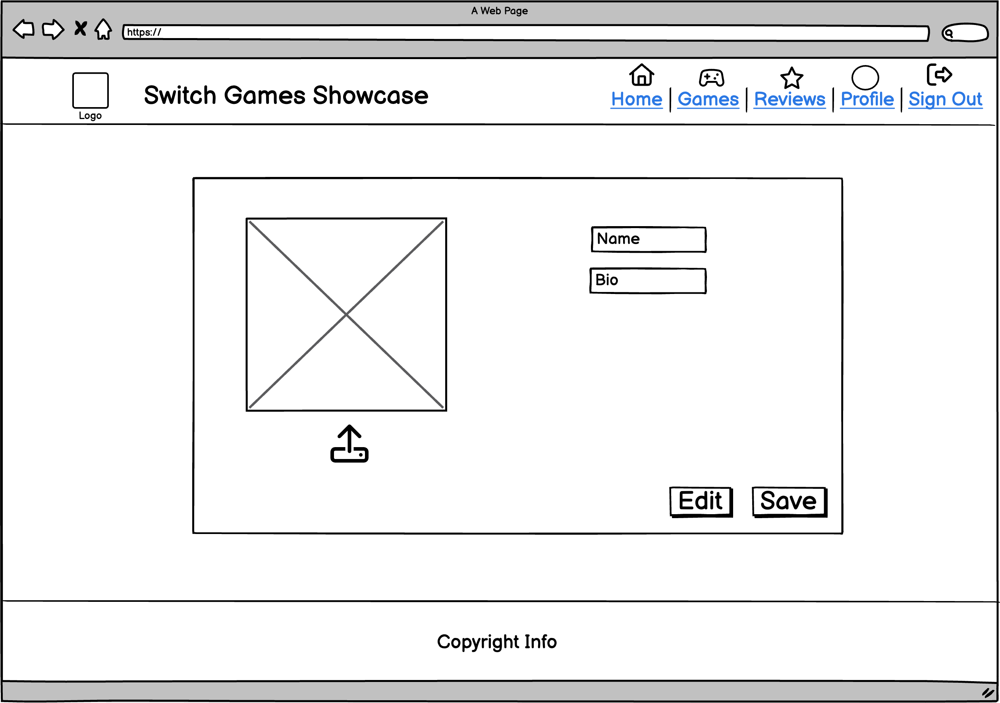

    

        Mobile Wireframes
    

    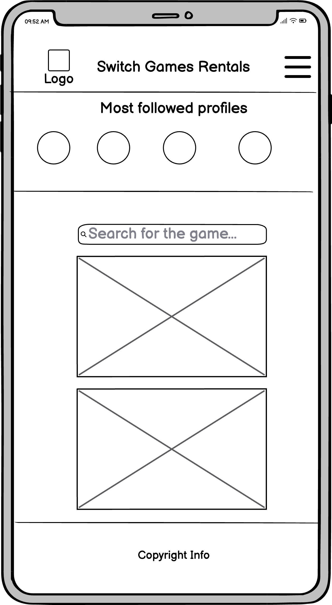
    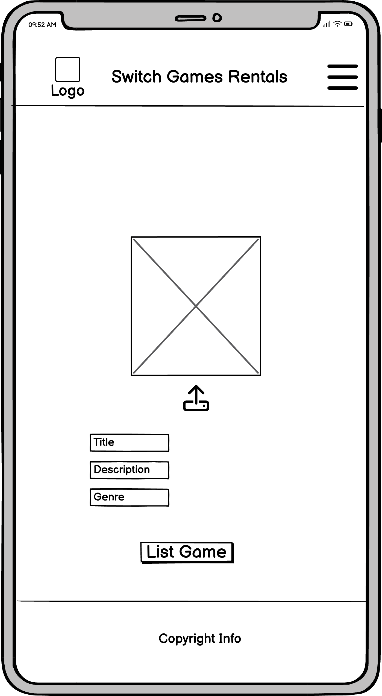
    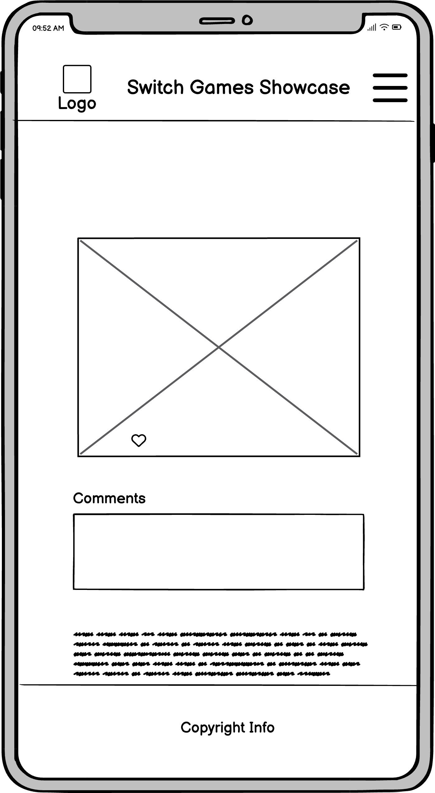
    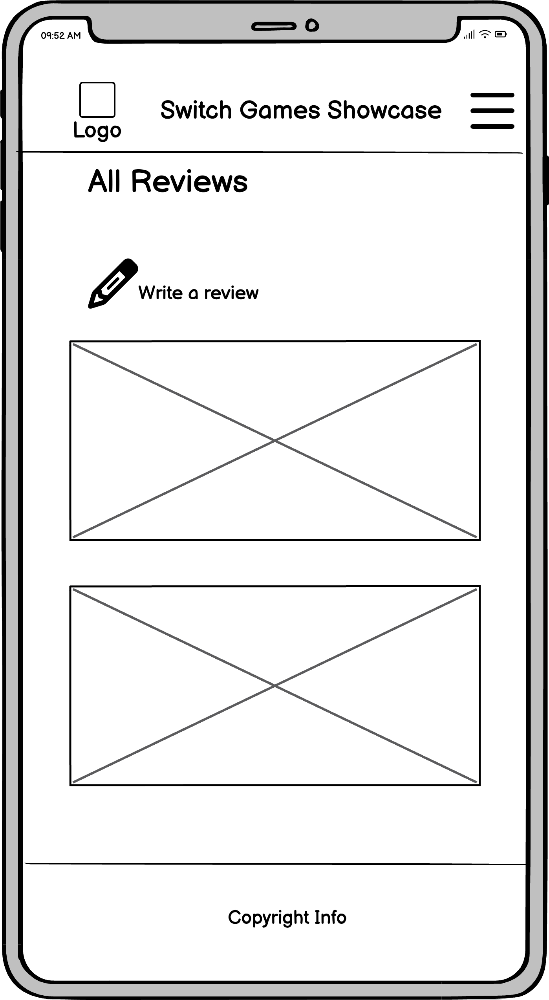
    
    
    

### Site Goals
Switch Games Showcase aims to be the ultimate platofrm for Nintendo gamers to explore, review, and engage with their favorite games. By offering a robust set of features:

- **Connect Gamers**: Foster a community where Nintendo Switch enthusiasts can share their thoughts, reviews, and experiences.
- **Enhance Discovery**: Provide users with tools to discover new games and learn about them through community-driven content.
- **Facilitate Engagement**: Enable users to interact with each other through reviews, comments, and likes, creating a vibrant and dynamic platform.
- **Provide Insights**: Offer in-depth reviews and ratings to help users make informed decisions about which games to play.

### Structure 
#### Home 
- **Game Feed**: Displays a vertical stack of game posts, allowing users to see brief information about each game, including title, cover image, genre, like and commend counts, and a short description. Each post is designed to be informative and visually appealing to encourage exploration and engagement.

- **Search Bar**: Positioned prominently, the search bar enables users to quickly and easily find specific games or discover new ones based on keywords or filters. This feature enhances user convenience by providing instant access to a wide array of games.

- **Followed Users Section**: This section highlights users that being followed most, making it easy to keep up with their game posts and reviews. It fosters community interaction by encouraging users to connect with other gamers.

##### User Goal
- Browse a curated feed of Nintendo Switch games shared by the community.
- Quickly search for and find games using the search bar.
- Follow other users and keep up with their latest posts and reviews.

##### Website Goal
- Provide a dynamic and engaging experience that encourages exploration of new and popular games.
- Facilitate community interaction and engagement through easy-to-use features.
- Ensure that users can quickly access the most relevant and interesting content.

#### Games Page
- **Game Creation**: Enables users to add new game instances to the library. Users can create a game instance by providing a title, description, selecting a genre, and uploading a cover image. This feature supports the platform's goal of expanding its game database through community contributions.

##### User Goal
- Add new game instances with detailed information.
- Allow users to Like, comment, engaging with the community.
- Game owner allowed to make changes to existing games and delete them.

##### Website Goal 
- Enable users to add new games, expanding the platform's content.
- Allow users to engage with games and each other through likes, comments, and favorites.
- Highlight new and popular games to keep the page dynamic and engaging.
- Ensure easy navigation and access to detailed game information.

#### Reviews Page
- **Review Creation**: The Reviews Page allows users to read and create reviews for various Nintendo Switch games. Each review includes a title, content, and rating, helping users make informed decisions about games they might want to play.
- **Review Feed**: The Reviews are stacked vertically allowing users to read through them, the reviews have all the neccessary information at a quick glance and by clicking on one it shows the full review in the window.

###### User Goal
- Users can easily submit their reviews for games, sharing their insights and opinions with the community.
- Users can quickly browse through a list of reviews, gaining a quick understanding of the community's opinions on various games.
- Users can click on a review to read the full content and get in-depth information about a game.

##### Website Goal
- Facilitate the creation and submission of reviews to build a comprehensive database of game evaluations.
- Provide a platform for users to easily browse, read, and interact with reviews.
- Allow users to quickly access and read detailed reviews to make informed decisions about which games to play.

#### Sign In / Sign Up Page
The Sign In / Sign Up Page is designed to provide users with a seamless and secure way to access their accounts. It emphasizes user convenience and security, ensuring a smooth entry into the platform. Below is a detailed structure for the Sign In Page:

- Username Field: A single field where users can enter either their email address or username. This flexibility allows for ease of access depending on what information the user remembers.
- Password Field: A secure field for entering the user's password. The field may include an eye icon to toggle visibility, helping users to avoid typing errors.
- Confirm Password Field: This field is used to re-enter the password that the user provided in the previous password field. The purpose is to ensure that the user has correctly typed their desired password and to help prevent errors or typos. 
- Sign In Button: A prominent button to submit the sign-in credentials.
- Sign Up Link: A link that directs users to the Sign Up Page if they do not already have an account, encouraging new user registrations.

##### User Goal
- Create Account: Register quickly and easily to start using the platform.
- Login Account: Sign in to your account to start using the platform.

##### Website Goal
- Increase User Base: Attract new users by providing a straightforward and welcoming registration process.

#### Profile Page
The Profile Page is designed to give users a personalized space where they can manage their account details, including their avatar, bio, username, and password.

##### User Goal
- Upload Button: A button to select an image file from the user's device.
- Preview: A preview of the uploaded image to ensure it appears as desired.
- Edit Option: Options to change current profile picture and bio.

##### Website Goal
- Enhance User Identity: Encourage users to personalize their profiles, fostering a sense of community and engagement.
- Facilitate Easy Management: Provide a straightforward interface for users to update and manage their account information.
- Ensure Security: Allow users to change passwords easily, helping maintain account security.
___
## Design 
### Color Scheme
The color choice used throught the side is to keep the traditional nintendo theme and alsoa dd a flair with a shade of purple to make it distinct and charming. 

### Typography
The font was carefully selected to emulate the original Nintendo Mario Kart 7 font. This choice was made to align with the theme of the website, which is centered around Nintendo Switch games. The typography not only pays homage to the beloved gaming franchise but also creates a nostalgic and engaging atmosphere for users. It helps establish a consistent and immersive user experience that reflects the fun and excitement associated with Nintendo games.

### Images 
 Images on the site primarily include user-selected content such as avatars and game covers, which allow users to personalize their profiles and game listings, fostering a sense of community and engagement. There is a nintendo franchise family hero image  with all beloved characters. Additionally, a prominent "Nintendo Franchise Family" hero image featuring beloved characters from various Nintendo games is included to create an immediate connection to the Nintendo brand and evoke nostalgia among visitors.

___
## Features
### Existing Features
#### Navbar
The navbar has a logo which links to th ehome page, and other pages which are dynamic based on user authenitcation. The navbar is designed to work across all screen sizes givng a different layout respectively.

    

        Desktop Navbar
    

    
    

    

        Mobile Navbar
    

    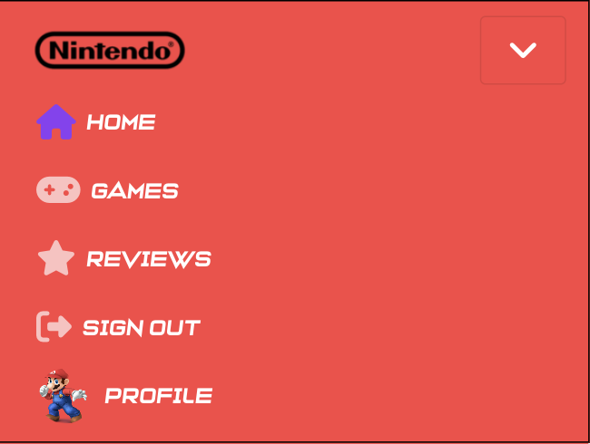
    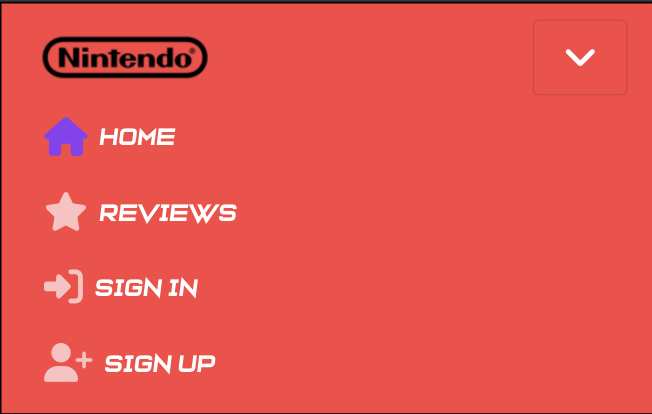

#### Search Bar
The home page features a prominently placed search bar at the top of the game feed, providing usersbto quickly and easily find specific games. This feature is designed to enhance the user experience by allowing efficient navigation through the extensive game library available on the site. 
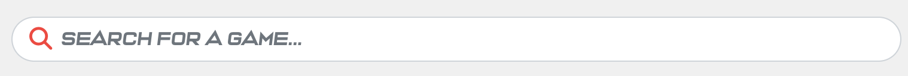

#### Game Feed
The posted games are shown in an vertical stacked format with recent ones being at the top allowing users to browse through extensive game libraries and find games of interest. They also see an overview of game information along with community engagements. 
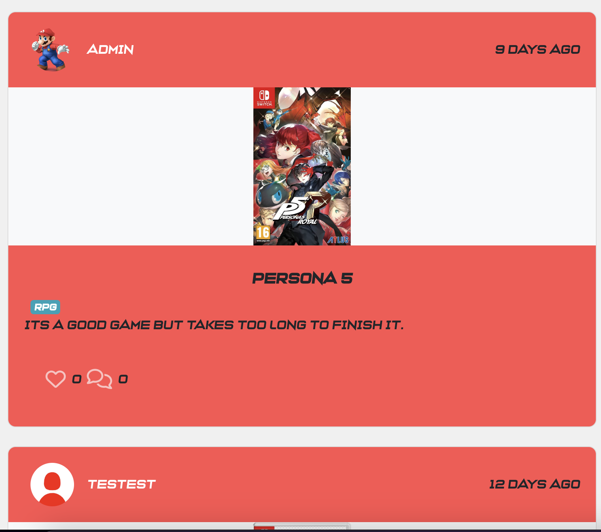

#### Game Detail
The Game Detail Page provides an in-depth view of each game, allowing users to explore individual game entries and interact with them through comments and owner of the game to either edit or delete them. 
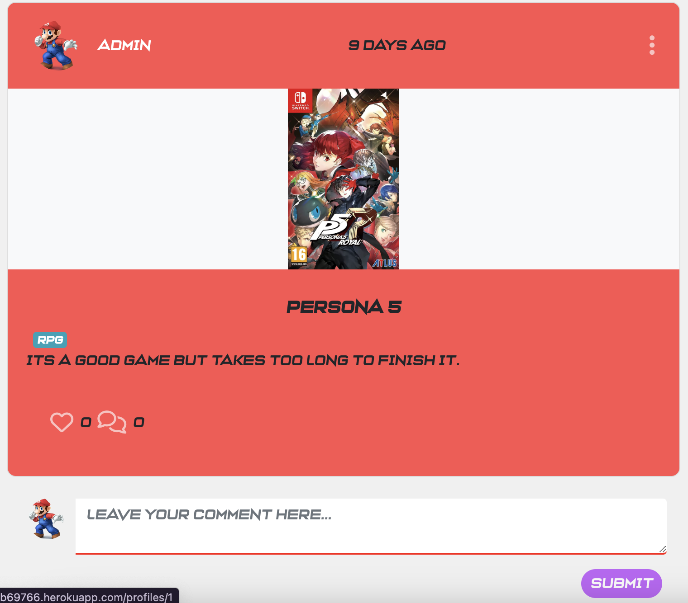

#### Edit / Delete
The game owner can choose to edit or delete it from the database with intuitive dropdown menu.

#### Like/Unlike & Comment
Authenticated users can like or unlike a game and leave comments, fostering community engagement.
  
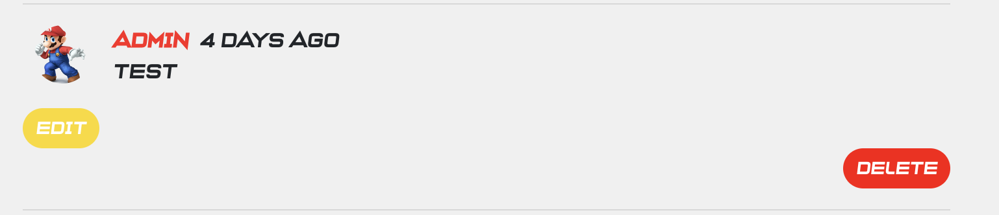  

#### Game Edit
Game owners can edit their game information and update it as desired.
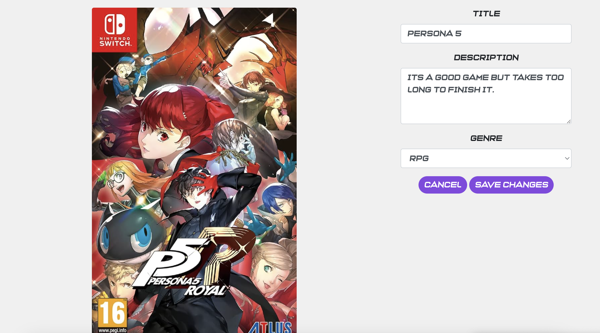

#### Game Creation
Users can create a new game instance with appropriate details to share with the community.
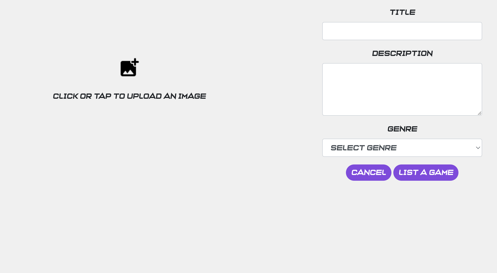

#### Review Creation
Users can write reviews for games available on the platform, offering their opinions and feedback.
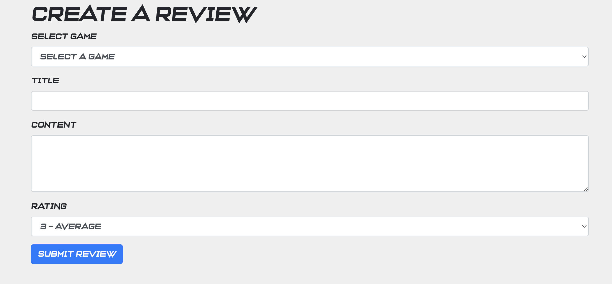

#### Review List
Visitors can view a list of game reviews on the platform and read through them.
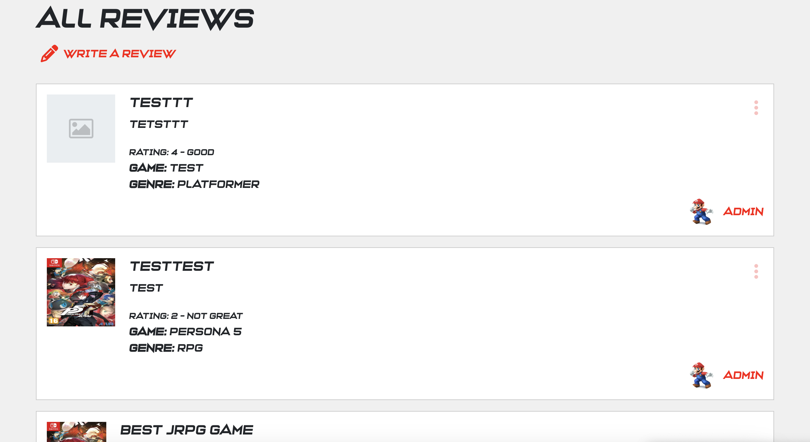

#### Review Detail
Visitors can view each review in-depth by clicking on the card providing a rich user experience.
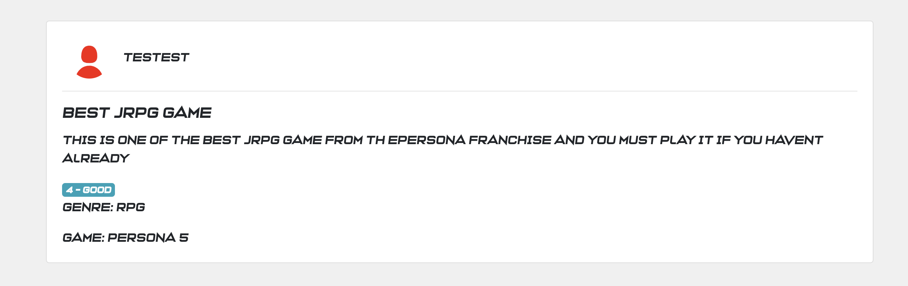

#### Profile
Users can easily follow or unfollow profiles with a single click. The follower count will automatically update to reflect any changes. Each profile section showcases the owner's name, a brief bio, and a comprehensive list of all the games they have created.
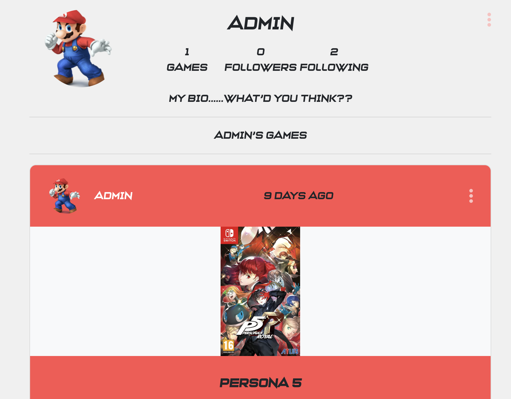

#### Edit Profile
Users have the ability to update their profile withthe following options:  
Name, Password, Bio and Avatar  
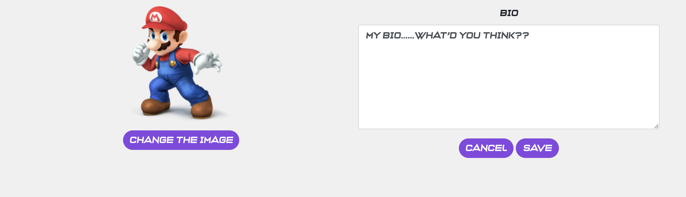
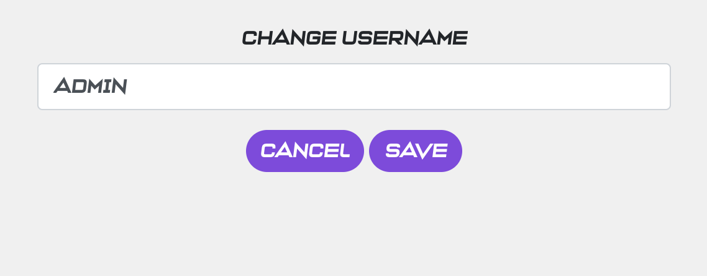  
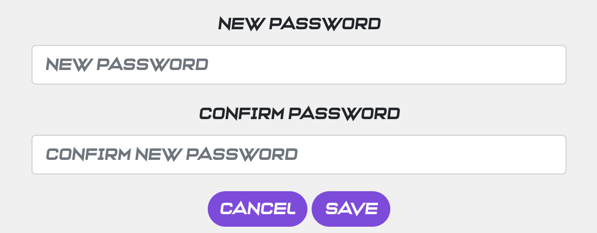

### Future Features
1. **Filter Games by Genre**  
Feature Description: Introduce a filtering system that allows users to search for games based on their genre.  
User Benefit: Users will be able to quickly find games that match their interests, making the browsing experience more personalized and efficient.

2. **Follower Feed Extensive**  
Feature Description: Add and expand the follower feed to include more comprehensive updates and interactions.  
User Benefit: Followers can stay updated on all activities, content, and interactions of the profiles they follow, creating a more engaging experience.

3. **Rental Sytem**  
Feature Description: Implement a rental system that allows users to rent games from their respective owners using a calendar function to manage rental periods.
___
## Database Design 
### Database (ERD) Table
The table was made using a website called draw.io from [here](https://app.diagrams.net/)  
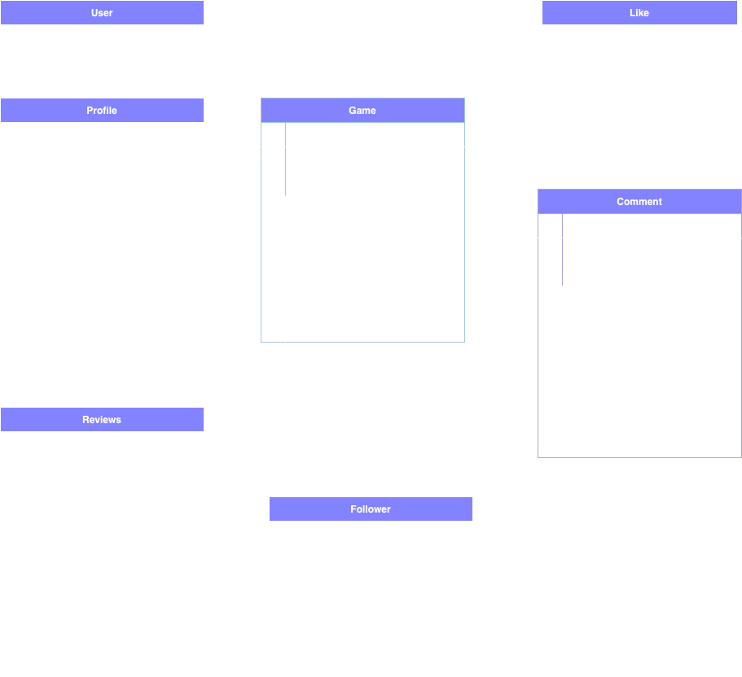

### CRUD 
The CRUD functionality is integrated into both game and profile entities. These operations form the backbone of the platform, providing users with full control over their data, including the ability to create, read, update, and delete games , create and reviews, and profile information.

### API Endpoints
                                                                                                    
<table border="3" cellspacing="0" cellpadding="5">
  <tr>
    <th>Operation</th>
    <th>Endpoint</th>
    <th>HTTP Method</th>
    <th>Description</th>
  </tr>
  <tr>
    <td>Review List</td>
    <td>/api/reviews</td>
    <td>GET</td>
    <td>Retrieve a list of all reviews.</td>
  </tr>
  <tr>
    <td>Review Detail</td>
    <td>/api/reviews/{id}</td>
    <td>GET</td>
    <td>Retrieve details of a specific review.</td>
  </tr>
  <tr>
  <td>Review Create</td>
  <td>/api/reviews</td>
  <td>POST</td>
  <td>Create a new review.</td>
  </tr>
  <tr>
    <td>Review Delete</td>
    <td>/api/reviews/{id}</td>
    <td>DELETE</td>
    <td>Delete a specific review by ID.</td>
  </tr>
  <tr>
    <td>Game List</td>
    <td>/api/games</td>
    <td>GET</td>
    <td>Retrieve a list of all games.</td>
  </tr>
  <tr>
    <td>Game Detail</td>
    <td>/api/games/{id}</td>
    <td>GET</td>
    <td>Retrieve details of a specific game.</td>
  </tr>
  <tr>
    <td>Game Edit</td>
    <td>/api/games/{id}</td>
    <td>PUT</td>
    <td>Update details of a specific game.</td>
  </tr>
  <tr>
    <td>Game Delete</td>
    <td>/api/games/{id}</td>
    <td>DELETE</td>
    <td>Delete a specific game by ID.</td>
  </tr>
  <tr>
    <td>Like Game</td>
    <td>/api/games/{id}/like</td>
    <td>POST</td>
    <td>Like a specific game by ID.</td>
  </tr>
  <tr>
    <td>Unlike Game</td>
    <td>/api/games/{id}/like</td>
    <td>DELETE</td>
    <td>Unlike a specific game by ID.</td>
  </tr>
  <tr>
    <td>Comment List</td>
    <td>/api/games/{id}/comments</td>
    <td>GET</td>
    <td>Retrieve a list of comments for a game.</td>
  </tr>
  <tr>
    <td>Comment Create</td>
    <td>/api/games/{id}/comments</td>
    <td>POST</td>
    <td>Create a new comment under a specific game.</td>
  </tr>
  <tr>
    <td>Comment Edit</td>
    <td>/api/comments/{id}</td>
    <td>PUT</td>
    <td>Edit a specific comment by ID.</td>
  </tr>
  <tr>
    <td>Comment Delete</td>
    <td>/api/comments/{id}</td>
    <td>DELETE</td>
    <td>Delete a specific comment by ID.</td>
  </tr>
  <tr>
    <td>Follower List</td>
    <td>/api/users/{id}/followers</td>
    <td>GET</td>
    <td>Retrieve a list of followers for a user.</td>
  </tr>
  <tr>
    <td>Following List</td>
    <td>/api/users/{id}/following</td>
    <td>GET</td>
    <td>Retrieve a list of users a user follows.</td>
  </tr>
  <tr>
    <td>Follow User</td>
    <td>/api/users/{id}/follow</td>
    <td>POST</td>
    <td>Follow a specific user by ID.</td>
  </tr>
  <tr>
    <td>Unfollow User</td>
    <td>/api/users/{id}/unfollow</td>
    <td>DELETE</td>
    <td>Unfollow a specific user by ID.</td>
  </tr>
</table>

## Technologies Used
### Fundementals
- Draw.io for Entity-Relation Diagram
- Balsamiq for Wireframes
- Cloudinary for storing images
- Elephant SQL for storing data
- Gitpod for Development
- Heroku for Hosting App

### Backend
#### Frameworks and Libraries
- Django
- Django REST Framework
- Django Rest Auth 
- Django Allauth 
- Django Cloudinary Storage 
- Django CORS Headers 
- Django Filter

#### Security and Authentication
- Django REST Framework SimpleJWT 
- OAuthlib 
- PyJWT

#### Database
- dj-database-url 
- psycopg2
- sqlparse 

#### Deployment and Hosting
- Gunicorn 
- Whitenoise

#### Image Processing
- Pillow 

### Frontend
#### Core Libraries and Frameworks
- React 
- React Router DOM

#### UI Components and Styling
- React Bootstrap
- React Infinite Scroll Component 

#### Data Handling and State Management
- Axios
- JWT Decode 
- Moment
___
## Testing 
### Manual Testing
The detailed manual testing including step-by-step instructions, test cases, expected outcomes, and pass/fail statuses, have been comprehensively documented in a separate file. This file includes all necessary details to understand the testing process and results.  

Please refer to the [Manual Testing Documentation](TESTING.md) for a complete overview.  

### Validator Testing
[Free Formatter](https://www.freeformatter.com/html-validator.html) was used to check for any errors or bad practices.  
- Home 
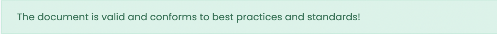
- Games

- Game Detail

- Game Edit

- Reviews

- Review Detail

- Profile

- Sign In

- Sign Up

### CSS Validator by [W3C Jigsaw](https://jigsaw.w3.org/css-validator/)
All CSS code passed the Validator checks.  

### Python [Linter](https://pep8ci.herokuapp.com/)
All python code passed the CI Python Linter pep8 Standard check.
1. drf-api-sgr 
 - models &#x2714;
 - serializers &#x2714;
 - views &#x2714;
 - permissions &#x2714;
 - settings &#x2714;
 - urls &#x2714;

2. comments
 - admin &#x2714;
 - models &#x2714;
 - serializers &#x2714;
 - views &#x2714;
 - urls &#x2714;

3. follower
 - admin &#x2714;
 - models &#x2714;
 - serializers &#x2714;
 - views &#x2714;
 - urls &#x2714;

4. games
 - admin &#x2714;
 - models &#x2714;
 - serializers &#x2714;
 - views &#x2714;
 - urls &#x2714;

5. likes
 - admin &#x2714;
 - models &#x2714;
 - serializers &#x2714;
 - views &#x2714;
 - urls &#x2714;

6. profiles
 - admin &#x2714;
 - models &#x2714;
 - serializers &#x2714;
 - views &#x2714;
 - urls &#x2714;

7. reviews
 - admin &#x2714;
 - models &#x2714;
 - serializers &#x2714;
 - views &#x2714;
 - urls &#x2714;

### Lighthouse
- Desktop 
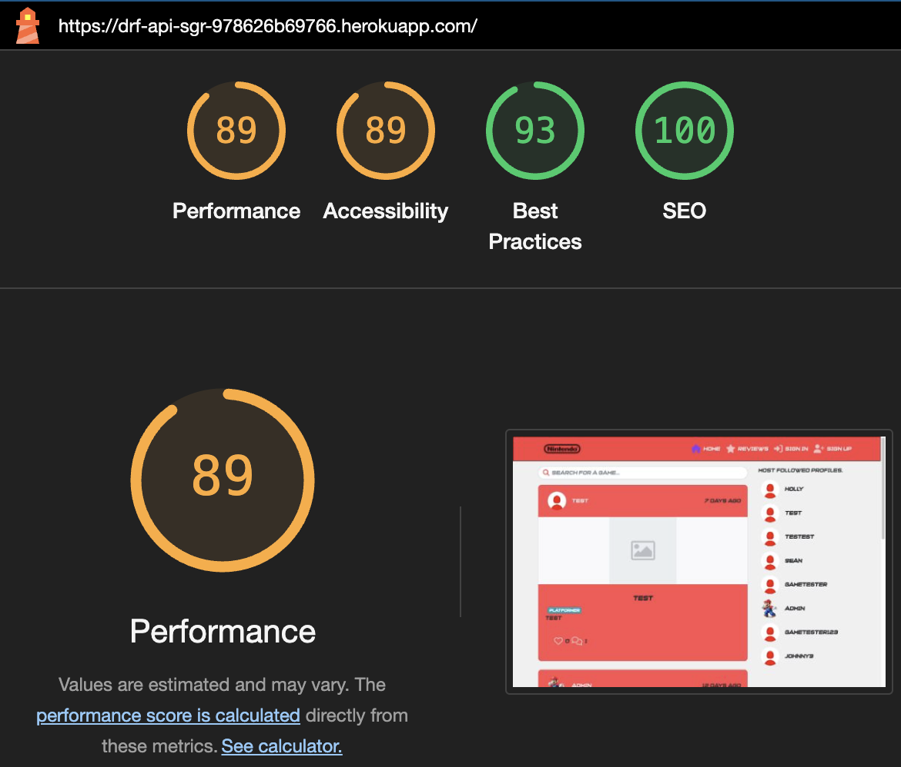

- Mobile
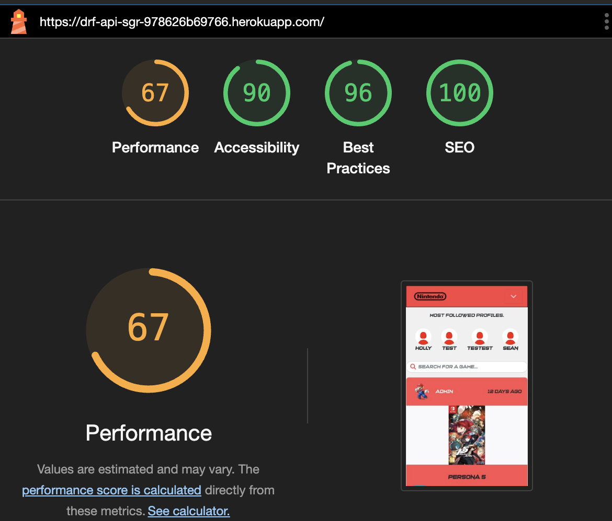
The Performance score is currently suboptimal due to the manner in which images are loaded on the website. These images are served through Cloudinary, a third-party service that handles image storage and delivery.

### Browser Testing
<table  border="3" cellspacing="0" cellpadding="5">
<tr>
<th>Browser</th>
<th>Layout</th>
<th>Functionality</th>
</tr>
<tr>
<th>Chrome</th>
<th>&#x2714;</th>
<th>&#x2714;</th>
</tr>
<tr>
<th>Firefox</th>
<th>&#x2714;</th>
<th>&#x2714;</th>
</tr>
<tr>
<th>Safari</th>
<th>&#x2714;</th>
<th>&#x2714;</th>
</tr>
</table>
___
