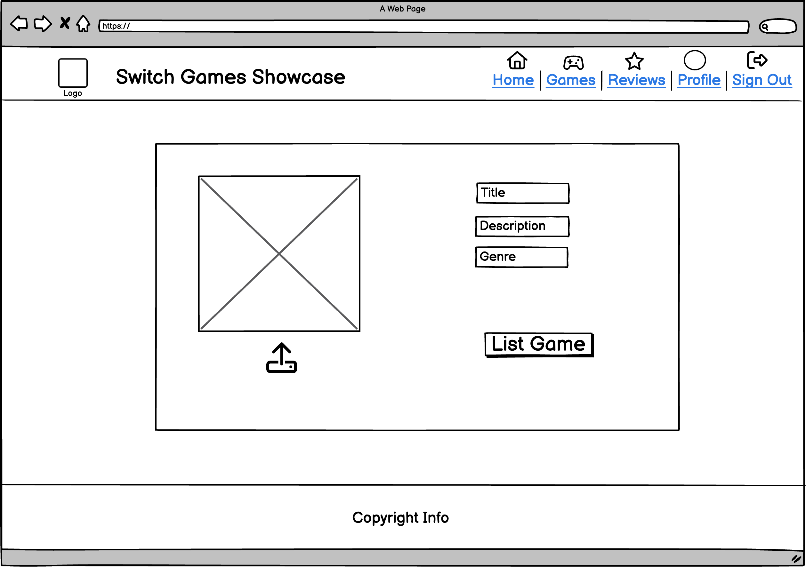
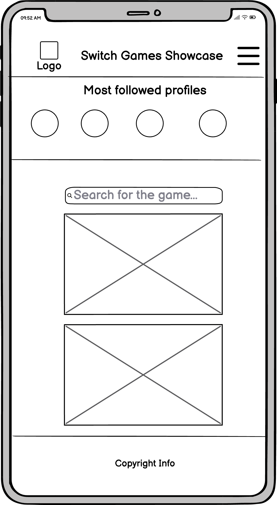

# SwitchGamesShowcase
## Overview
SwitchGamesShowcase is a platform dedicated to reviewing and exploring Nintendo Switch games. It provides users with the ability to browse and review games, enhancing their gaming experience by offering insights, liking, and community interactions.  
Check out the live version of the website [here](https://drf-api-sgr-978626b69766.herokuapp.com/).

## Purpose
SwitchGamesShowcase aims to provide Nintendo Switch enthusiasts with a seamless platform to explore and review their favorite games. By leveraging APIs and integrating robust frontend technologies, the goal is to deliver a user-friendly experience that allows for easy navigation, game discovery.
___
## UI/UX
The design of SwitchGamesShowcase focuses on simplicity and intuitive user experience, ensuring gamers can easily browse and review games. The UI draws inspiration from the walkthrough project to provide a social media-like platform treatment that feels familiar.

### Agile Methodology 
Agile method was followed during the development of the site to ensure the best outcome through iterative progress. This approach enabled us to adapt to changes, prioritize features effectively, and ensure the end product meets user expectations.
I utilized a Kanban board to track progress, manage features, and address user stories effectively. You can view the Kanban board and follow the development journey [here](https://github.com/users/sakixchy/projects/10/).

### Wireframes

I used [Balsamiq](https://balsamiq.com/) to create the wireframes for desktop and mobile version of the website. They are purely conceptual layouts and doesn't represent final wesbite.

Below you'll find all the images of wireframes:  

    

        Desktop Wireframes
    

    
    
    
    
    
    
    

    

        Mobile Wireframes
    

    
    
    
    
    
    
    

### Site Goals
Switch Games Showcase aims to be the ultimate platofrm for Nintendo gamers to explore, review, and engage with their favorite games. By offering a robust set of features:

- **Connect Gamers**: Foster a community where Nintendo Switch enthusiasts can share their thoughts, reviews, and experiences.
- **Enhance Discovery**: Provide users with tools to discover new games and learn about them through community-driven content.
- **Facilitate Engagement**: Enable users to interact with each other through reviews, comments, and likes, creating a vibrant and dynamic platform.
- **Provide Insights**: Offer in-depth reviews and ratings to help users make informed decisions about which games to play.

### Structure 
#### Home 
- **Game Feed**: Displays a vertical stack of game posts, allowing users to see brief information about each game, including title, cover image, genre, like and commend counts, and a short description. Each post is designed to be informative and visually appealing to encourage exploration and engagement.

- **Search Bar**: Positioned prominently, the search bar enables users to quickly and easily find specific games or discover new ones based on keywords or filters. This feature enhances user convenience by providing instant access to a wide array of games.

- **Followed Users Section**: This section highlights users that being followed most, making it easy to keep up with their game posts and reviews. It fosters community interaction by encouraging users to connect with other gamers.

##### User Goal
- Browse a curated feed of Nintendo Switch games shared by the community.
- Quickly search for and find games using the search bar.
- Follow other users and keep up with their latest posts and reviews.

###### Website Goal
- Provide a dynamic and engaging experience that encourages exploration of new and popular games.
- Facilitate community interaction and engagement through easy-to-use features.
- Ensure that users can quickly access the most relevant and interesting content.